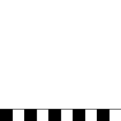

## Announcements
- Problem Set 2 due on Monday night!
	- Remember you can contact your section leader if you have questions as well
	- You'll absolutely have everything to complete it after today
- I'll be trying to get out feedback on PS1 over the weekend. Sorry I'm a bit behind, I had to write a test.
- Normal lab today
- Polling: [rembold-class.ddns.net](http://rembold-class.ddns.net)

## Review Question
Which of the below images would be produced by the following code?
```python
gw = GWindow(200,200)
for c in range(0,10):
    for r in range(0,10):
        rect = GRect(20*c,20*r,20,20)
        if (r+c) % 2 != 0:
            rect.set_filled(True)
    gw.add(rect)
```

:::cols

::::col
{width=80%}
::::
::::col
{width=80%}
::::
::::col
{width=80%}
::::
::::col
{width=80%}
::::

:::

<!--
## Review Question
:::: cols
::: col
When the final line of the code to the right is run, what type of variable is `x`?

:::::{.poll}
#. `integer`{.no-highlight}
#. `float`{.no-highlight}
#. `string`{.no-highlight}
#. None of the above
:::::
:::

::: col
```python
def func(A):
	m = str(A)
	n = m + m + m
	print(n)

y = 5.0
x = func(y)
print(type(x))
```
:::
::::
-->

## Label It!
- Sometimes you need to add some text to the window
- Can display any string using `GLabel` using the following format:

```python
msg = GLabel(string_to_add, x_location, y_location)
```
- Here `string_to_add` is the text you want to display, and `x_location` and `y_location` are the (x,y) coordinates of where you want to place the origin of the label.


## Label Geometry
- The `GLabel` class relies on some geometrical concepts that are derived from classical typesetting
	- The _baseline_ is the imaginary line on which the characters rest
	- The _origin_ is the point on the baseline at which the text begins
	- The _width_ is the horizontal distance from the origin to the end of the text
	- The _height_ of the font is the distance between adjacent baselines
	- The _ascent_ is the distance the characters rise above the baseline
	- The _descent_ is the distance the characters drop below the baseline
<br><br>


## Interacting with Labels
- A `GLabel` has several special methods that you can use to interact with it
	- You can use: `get_width()`, `get_height()`, `get_ascent()`, and `get_descent()` methods to obtain the geometric properties
	- You can set a special font for the label using
	
	```python
	labelname.set_font(font)
	```
	- Where `font` is a string comprised of the following elements:
		- The _font style_, which is usually blank or `italic`
		- The _font weight_, which is usually blank or `bold`
		- The _font size_, which is a number followed by the units (typically `pt`, `px`, or `em`)
		- The _font family_, which is the name of the font. Because what fonts are available can differ from machine to machine, the family is usually a sequence of fonts separated by commas
		- The font family sequence usually ends with a standard family (`serif`, `sans-serif`, or `monospace`) to ensure that the label can display

## Label Example
```python
gw = GWindow(500, 200)
msg = GLabel("hello world!", 50, 100)
msg.set_font("italic bold 80px 'times new roman'")
gw.add(msg)
```
<br><br>

{width=50%}

## Centering a `GLabel`
- Frequently useful to center within the window or some shape
- To center properly, you need to know the label dimensions, but you can't determine the dimensions until after you've created the label!
- The main idea then is to:
	- Create a `GLabel` without setting its location
	- Call the `.set_font()` method to set the desired font (which could change the size)
	- Determine the horizontal position of the origin by subtracting half the width from the desired location x
	- Determine the vertical position of the baseline by adding half the ascent to the desired location y
	- Add the `GLabel` at the newly calculated position


## Centering Example
```python
gw = GWindow(500, 200)
msg = GLabel("hello world!")
msg.set_font("italic bold 20px 'times new roman'")
x = gw.get_width()  / 2 - msg.get_width()  / 2
y = gw.get_height() / 2 + msg.get_ascent() / 2
gw.add(msg, x, y)
```

<!--
## Stepwise Refinement
- The most effective way to solve complex problems is to break them down into successively smaller and simpler sub-problems
- Start by breaking the whole task into simpler parts
	- Some of those parts may need more sub-parts
- Entire process is called _stepwise refinement_ or _decomposition_

\begin{tikzpicture}%%width=70%
	[
	every node/.style={draw, very thick, rounded corners, Green, font=\LARGE\bf, inner sep=2mm}
	]
	\node(a) at (0,0) {Complete Task};
	\node[right = 2cm of a](b2) {Subtask 2};
	\node[above = of b2](b1) {Subtask 1};
	\node[below = of b2](b3) {Subtask 3};
	\node[above right= 3mm and 2cm of b2](c1) {Subsubtask 1};
	\node[below right= 3mm and 2cm of b2](c2) {Subsubtask 2};
	\draw[ultra thick, Blue] (a.east) edge (b1.west) edge (b2.west) edge (b3.west)
		(b2.east) edge (c1.west) edge (c2.west);

\end{tikzpicture}


## Choosing a Decomposition
The proposed steps should be easy to explain.
: One indication that you have succeeded is being able to find simple names.

The steps should be as general as possible.
: Code gets reused all the time in programming. If your functions perform general tasks, they are much easier to reuse.

The steps should make sense at the level of abstraction in which they are used.
: If you have a function or method that does the correct job but whose name doesn't fit or make sense in the contex of the problem, consider defining a new method that calls the old one.


## House Decomposition
How could we think about decomposing the problem of drawing the below house?
<br><br>


-->


## Function Review
- A _function_ is just a sequence of statements that have been collected together and given a name
	- Makes it possible to execute the statements multiple times much more easily
- Some reminders about vocabulary:
	- Invoking or running a function by name is known as **calling** that function.
	- The caller passes information to a function using **arguments**.
	- When a function completes its block of code, it **returns** to its caller.
	- The function gives information back to the caller by **returning a result**
- Syntax:
```python
def function_name( parameter_list ):
	function_body
```

## Predicate Functions
- Functions that return a Boolean value are called _predicate functions_
```python
def is_divisible_by(x, y):
	return x % y == 0
```
- Once you have defined a predicate function, you can use it in any conditional expression!
```python
for i in range(1, 100):
	if is_divisible_by(i, 7):
		print(i)
```


## Predicate No-nos
- Don't complicate your code for no reason!
- Work directly with the boolean values when possible
- Try not to code patterns like the following:
```{.python .badcode}
def is_divisible_by(x, y):
	if x % y == 0:
		return True
	else:
		return False
```
```{.python .badcode}
for i in range(1, 100):
	if is_divisible_by(i,7) == True:
		print(i)
```


## A Perfect Example
- Greek mathematicians took special interest in numbers that are equal to the sum of their proper divisors, called _perfect numbers_
- A proper divisor of `n` is any value than evenly divides `n` and which is less than `n`
- Suppose we wanted to write a function to find all the perfect numbers between two limits
	- How could we approach breaking this down into smaller parts?
	- What might those parts look like?
- To check our program, the first 4 perfect numbers greater than 1 are: 6, 28, 496, 8128


## Parameter Purposes
- Functions perform some sort of service for their callers
- It is necessary for them to know enough details so that they can carry out the requested task
	- Imagine you were trying to accomplish the task yourself!
	- What is the minimum amount of information you would need to know?
- The necessary information needed for the function to generally accomplish its task is the information conveyed in the parameters


## Jockeying for Position
- So far we have used a positional way to assign arguments to parameters
	- First argument to first parameter, second to second parameter, etc

	```python-repl
	>>> def func( first, second, third ):
			print( first, second, third )
	>>> func(1,2,3)
	1 2 3
	>>> func(2,6,4)
	2 6 4
	```

## The Word is Key
- Arguments may also be specified by a _keyword_, in which the caller precedes the argument with a parameter name and equals sign
- Always stores the argument value in the specified parameter

```python-repl
>>>  def func( first, second, third ):
		print( first, second, third )
>>>  func(third=4, first=2, second=6)
2 6 4
```
- Keyword arguments can appear in any order
- **All keyword arguments must come after any positional arguments!**


## Default Slide Title
- Python allows you to specify a default value for a parameter, which is will use if one is not directly supplied
- Do so by adding an equals sign and a value after the parameter name
	- So you define default values when you define the function
```python
def introduction(name='Jed', age=35):
	print('My name is ', name, ' and I am ', age)
```
- If providing any parameters after a default parameter, you must indicate them through keywords
```{.python-repl style="max-height: 300px"}
>>> introduction()
My name is Jed and I am 35
>>> introduction('Bob', 25)
My name is Bob and I am 25
>>> introduction('Larry')
My name is Larry and I am 35
>>> introduction(age=68)
My name is Jed and I am 68
```
