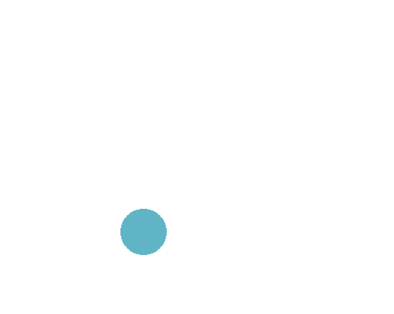

## Announcements
- Problem Set 3 due tonight!
	- I'm working through PS2 feedback still, so keep an eye out for that.
- Project 1 guide is posted!
	- Due a week from today
	- Get started on it tomorrow! If you can have the first two milestones completed before heading into your section meetings in the middle of the week, you'll be in a great place.
	- Last info that you really need for it is discussed today
- Polling: [rembold-class.ddns.net](http://rembold-class.ddns.net)


## Review Question! {data-notes="Solution: Shrinks and then filled"}
::::::cols
::::col
When the function `rev_q` is called, what happens when the mouse is clicked?

:::{.poll}
#. The square shrinks
#. The square gets filled
#. The square shrinks and then gets filled
#. The square gets filled and then shrinks
:::

::::

::::{.col style="flex-grow:2"}
```{.python style="max-height:900px; font-size:.75em"}
def rev_q():
    def act_A(e):
        sq.set_filled(True)
    def act_B(e):
        sq.set_size(
			sq.get_width() - 10,
			sq.get_height() - 10
		)
    gw = GWindow(500, 500)
    sq = GRect(200, 200, 100, 100)
    sq.set_color("blue")
    gw.add(sq)
    gw.add_event_listener("mousedown", act_B)
    gw.add_event_listener("click", act_A)
```

::::
::::::


## Using `GState`
- The PGL library has a `GState` object type that we can import to use for sharing data between callback functions
- Create a variable, conventionally called `gs` immediately after creating the window:
```python
gw = GWindow(WIDTH, HEIGHT)
gs = GState()
```
- Value to be shared can be stored as part of the `gs` variable as an object attribute, which we will talk much more about in Ch 9
	- For now, shared variables should include `gs` and then a period before the variable name. Eg: `gs.my_variable`
	- So `line` will become `gs.line` everywhere in our example

## Fixed Line-Drawing
```{.python style="max-height:900px;"}
from pgl import GWindow, GLine, GState

WIDTH = 500
HEIGHT = 500

def draw_lines():
	def mousedown_event(e):
		x = e.get_x()
		y = e.get_y()
		gs.line = GLine(x,y,x,y)
		gw.add(gs.line)

	def drag_action(e):
		gs.line.set_end_point(e.get_x(), e.get_y())

	gw = GWindow(WIDTH, HEIGHT)
	gs = GState()
	gs.line = None
	gw.add_event_listener("mousedown", mousedown_event)
	gw.add_event_listener("drag", drag_action)

if __name__ == '__main__':
	draw_lines()
```


## Timer Events
- Previously we looked at how to our programs could react to mouse events
- Can also listen for _timer events_, which occur after a specific time interval
- You specify the listener for a timer event in the form of a callback function that is invoked at the end of the time interval
- Can add animation to our graphics by creating a timer whose callback makes small updates to the graphical objects in the window
	- If the time interval is short enough (usually sub 30 milliseconds), the animations will appear smooth to the human eye


## Timer Types
- PGL supports two kinds of timers:
	- A _one-shot timer_ invokes its callback only once after a specified delay
		- Created with

			```python
			gw.set_timeout(function, delay)
			```
		  where `function` is the callback function and `delay` is the time interval in milliseconds
	- An _interval timer_ invokes its callback function repeatedly at regular intervals
		- Created with

			```python
			gw.set_interval(function, delay)
			```
- Both methods return a `GTimer` object that identifies the timer, and can be stopped by invoking the `.stop()` method on that timer


## Moving Square
```{.python style="max-height:900px"}
def moving_square():
    def step():
		square.move(dx, dy)
		if square.get_x() > 500:
			timer.stop()

	gw = GWindow(500, 200)
	dx = 1
	dy = 0
	square = create_filled_rect(12, 100, 24, 24, "red")
	gw.add(square)
	timer = gw.set_interval(step, 20)
```


## Growing Circles
{width=60%}


## Waiting vs Events
- Many would probably try to approach this doing something like as follows:
```python
def growing_circles():
	gw = GWindow(WIDTH, HEIGHT)
	for i in range(NUM_CIRCLES):
		# Create a new circle
		# Animate the circle to grow it
		# Wait for the animation to complete
```
- The problem here is that there is no clear way to "wait" for an animation to complete
	- There leaves no point in the program where a new event could "butt-in"
- Instead need an event that takes care of all the circle creation and animations


## Using Events Wisely
- Need to keep track of what the program **should** be doing, and then have the timer callback function handle whatever is needed
- Conceptually, for these circles, might look more like this:
```python
def step():
	if """ there is a circle still growing """
		"""then increase its size """
	elif """ a new circle needs to be created """
		""" then create one """
	else:
		timer.stop()
```


## Making those circles grow!
```{.python style='max-height:900px;'}
from pgl import GWindow, GState, GOval
import random

GWIDTH = 500
GHEIGHT = 400
N_CIRCLES = 20
MIN_RADIUS = 15
MAX_RADIUS = 100
DELTA_TIME = 10
DELTA_SIZE = 1

def random_color():
	color = "#"
	for i in range(6):
		color += random.choice("0123456789ABCDEF")
	return color

def create_filled_circle(x, y, r, color="black"):
	circ = Goval(x-r, y-r, 2*r, 2*r)
	circ.set_filled(True)
	circ.set_color(color)
	return circ

def growing_circles():
    def start_new_circle():
        r = random.uniform(MIN_RADIUS, MAX_RADIUS)
        x = random.uniform(r, GWIDTH - r)
        y = random.uniform(r, GHEIGHT - r)
        gs.circle = create_filled_circle(
							x, y, 
							0, random_color()
						)
        gs.desired_size = 2 * r
        gs.current_size = 0
        gs.circles_created += 1
        return gs.circle

    def step():
		# Grow a circle if needed
        if gs.current_size < gs.desired_size:
            gs.current_size += DELTA_SIZE
            x = gs.circle.get_x() - DELTA_SIZE / 2
            y = gs.circle.get_y() - DELTA_SIZE / 2
            gs.circle.set_bounds(
							x, y, 
							gs.current_size,
							gs.current_size
						)
		# or add a circle if you can
        elif gs.circles_created < N_CIRCLES:
            gw.add(start_new_circle())
		# or stop
        else:
            timer.stop()

    gw = GWindow(GWIDTH, GHEIGHT)
    gs = GState()
    gs.circles_created = 0
    gs.current_size = 0
    gs.desired_size = 0
    timer = gw.set_interval(step, DELTA_TIME)
```

