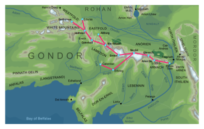
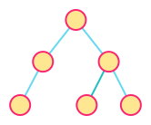

## Announcements
- Adventure Game Project due next Sunday night
- Nothing formal planned for sections this week. Contact your section leader if you want to meet them during the normal time for questions.
- Final Format
	- A change of pace from how the midterm was done
	- Will have a checklist of learning objectives from the 2nd half of the semester
	- You will be responsible for writing 1-2 programs that meet a certain number of those objectives
		- Programs will also need to accomplish something meaningful. Which is entirely up to you, but they can't exist soley to meet objectives.
	- Guidelines and objectives will be posted on Friday evening, and you'll have until the date of your final to have your programs submitted
- Polling: [rembold-class.ddns.net](http://rembold-class.ddns.net)

## Review Question {data-notes="Solution: {['A', 'B']: {1, 2}}"}
Three of the below expressions are valid; one is not. Which one would return an error?

:::{.poll}
#. `{'A': {'B': (1,2)}, 'C': 3}`
#. `{1, 2, (3,4), 5 }`
#. `[{'Alpha': 1, 'Omega': 26}, {2, 3, 4, 5}]`
#. `{['A', 'B']: {1, 2}}`
:::


## The Beacons of Gondor
> For answer Gandalf cried aloud to his horse. "On Shadowfax! We must hasten. Time is short. See! The beacons of Gondor are alight, calling for aid. War is kindled. See, there is the fire on Amon Dìn, and flame on Eilach; and there they go speeding west: Nardol, Erelas, Min-Rimmon, Calenhad, and the Halifirien on the borders of Rohan."
>
> -- <cite>J.R.R. Tolkien, The Return of the King, 1955</cite>

- Rohan alerted to danger by a succession of signal fires moving from mountain top to mountain top
- Mimics the idea of message passing in a linked list

## Linking Objects
- Since Python stores objects as references, it is possible to represent relationships among objects by linking them in various ways
- Simplest example of a linked structure is a _linked list_
	- Each object in a sequence contains a reference to the one that follows it, similar to a sequential treasure hunt
	
- Python marks the end of the linked list with a pointer to `None`
	- In diagrams, the `None` value is commonly shown as just a diagonal line across the box


## Lighting the Fires
```{.python style='max-height:900px;'}
class SignalTower:

    def __init__(self, name, link=None):
        self.name = name
        self.link = link

    def __str__(self):
        s = self.name
        if self.link is not None:
            return f"{s} -> {str(self.link)}"
        return s

    def get_name(self):
        return self.name

    def signal(self):
        print(f"Lighting {self.name}!")
        if self.link is not None:
            self.link.signal()

    @staticmethod
    def create_chain(names):
        towers = None
        for name in reversed(names):
            towers = SignalTower(name, towers)
        return towers


if __name__ == '__main__':
    names = [
			'Minas Tirith', 'Amon Din', 'Eilenach', 'Nardol', 
			'Erelas', 'Min-Rimmon', 'Calenhad', 'Halifierien', 
			'Rohan'
			]
    towers = SignalTower.create_chain(names)
    print(towers)
    towers.signal()
```

## Why Links?
::::::cols
::::col
{.stretch}
::::

::::col
- Suppose you are Thomas Jefferson and you've written this timeless document to mark our nations founding.

> "our repeated petitions have been answered by repeated injury."

- Now someone wants to add the word "only" after "answered". What do you do?

{class='fragment fade-in'}
::::
::::::

## Links to Order
- Storing text as one long string is cumbersome when insertions need to be made
	- Requires shifting everything else to make room for the new characters
- Alternatively, could store the text as a linked list of words


- Allows you to insert new words without changing any other words in memory!

## Comparisons
::::::cols
::::col
- Arrays
	- Can access any element by index in $\mathcal{O}(1)$ time
	- Generally static in length, though Python will readjust length on the fly if needed
	- Adding, inserting, or removing new elements is expensive, as all other elements need to be moved
::::

::::col
- Linked Lists
	- Must move through the whole list to get an element by index, taking $\mathcal{O}(N)$ time
	- Entirely flexible in length
	- Adding, inserting, or removing is very easy

::::
::::::


## Generalizing Links
- Each cell in a linked list contains a reference to the next cell, so they can be used to represent a chain of objects in some linear order
- Nothing fundamental restricts you though to just having one reference!
- Returning to the beacons of Gondor, a signal tower might be visible to more than one tower, allowing the signal to branch
	- This new structure is called a _tree_ by computer scientists

## Beacons of Gondor Tree {.data-auto-animate}
{data-id=0}

## Trees
::::::cols
::::col
- A _tree_ is a collection of objects called _nodes_
	- Begins at a single root node and connects to other nodes in branching, **non-cyclical**, patterns
- Trees appear in many familiar contexts:
	- Family trees
	- Evolutionary trees
	- Object-oriented hierarchies in programming languages like Python
::::

::::col

::::
::::::

## Family Trees
::::::cols
::::col
- Family trees are common examples of a tree structure
- Useful for defining terminology
	- William I is the _root_ of the tree
	- Adela is a _child_ of William I and the _parent_ of Stephen
	- Robert, William II, Adela, and Henry and _siblings_
	- Henry II is a _descendant_ of William I, Henry I, and Matilda
	- William I is an _ancestor_ of everyone else in this tree
::::

::::col
\begin{tikzpicture}%%width=100%
[
	every node/.style={MBlue, font=\LARGE\bf, anchor=center},
]
\node (w1) at (0,0) {William I};
\node[below left = 2cm and 3cm of w1] (rob) {Robert};
\node[below left = 2cm and -1cm of w1] (w2) {William II};
\node[below right = 2cm and -1cm of w1] (ad) {Adela};
\node[below right = 2cm and 3cm of w1] (Hen) {Henry I};
\node[below = 2cm of ad ] (st) {Stephen};
\node[below left = 3cm and -1cm of Hen ] (Wil0) {William};
\node[below right = 3cm and -1cm of Hen ] (Mat) {Matilda};
\node[below = 2cm of Mat ] (Hen2) {Henry II};
\draw[ultra thick, MRed]
	(w1) edge (rob) edge (ad) edge (Hen) edge (w2)
	(ad) edge (st)
	(Hen) edge (Wil0) edge (Mat)
	(Mat) edge (Hen2);
\end{tikzpicture}
::::
::::::

## Binary Search Trees
- Trees can be used to implement dictionaries using a structure called a _binary search trees_ (or _BST_)
- Each node in a BST has exactly two subtrees:
	- A _left subtree_ that contains all nodes before the current node
	- A _right subtree_ that contains all the nodes that come after it
- The classic example of a binary search tree uses the names of the seven dwarves:

\begin{tikzpicture}%%width=70%
[
	every node/.style={MBlue, font=\LARGE\bf, anchor=center, minimum size=1cm, },
	lines/.style={-latex, MRed, ultra thick},
]
\node (grumpy) at (0,0) {Grumpy};
\node[below left = 0.5cm and 2cm of grumpy] (doc) {Doc};
\node[below right= 0.5cm and 2cm of grumpy] (sleepy) {Sleepy};
\node[below left = 0.5cm and 0.5cm of doc] (bashful) {Bashful};
\node[below right= 0.5cm and 0.5cm of doc] (dopey) {Dopey};
\node[below left = 0.5cm and 0.5cm of sleepy] (happy) {Happy};
\node[below right= 0.5cm and 0.5cm of sleepy] (sneezy) {Sneezy};

\node at (-5,1) {};

\draw[lines, o-latex] (-5,1) -| (grumpy);
\draw[lines] (grumpy) -| (doc);
\draw[lines] (grumpy) -| (sleepy);
\draw[lines] (doc) -| (bashful);
\draw[lines] (doc) -| (dopey);
\draw[lines] (sleepy) -| (happy);
\draw[lines] (sleepy) -| (sneezy);
\end{tikzpicture}


## Balance Your Trees
- Ideally, a binary search tree would look similar to our last picture
- If you placed a different dwarf at the root, then the tree would end up unbalanced
	- If you placed Bashful at the root, the entire left subtree would be empty!
- Balancing BST's is important for effectively and quickly finding the desired values
- If you go on to take CS 343 (Analysis of Algorithms), you will learn several strategies for maintaining balanced binary search trees
