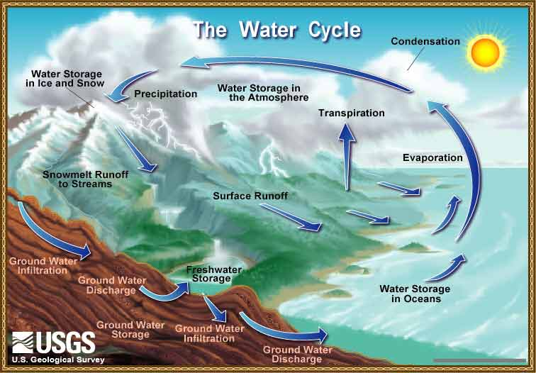

## Announcements
- Project 5 due Wednesday
- Lab today open for Project questions
- Polling: [rembold-class.ddns.net](http://rembold-class.ddns.net)

## Family Trees
::::::cols
::::col
- Family trees are common examples of a tree structure
- Useful for defining terminology
	- William I is the _root_ of the tree
	- Adela is a _child_ of William I and the _parent_ of Stephen
	- Robert, William II, Adela, and Henry and _siblings_
	- Henry II is a _descendant_ of William I, Henry I, and Matilda
	- William I is an _ancestor_ of everyone else in this tree
::::

::::col
\begin{tikzpicture}%%width=100%
[
	every node/.style={Orange, font=\LARGE, anchor=center},
]
\node (w1) at (0,0) {William I};
\node[below left = 2cm and 3cm of w1] (rob) {Robert};
\node[below left = 2cm and -.5cm of w1] (w2) {William II};
\node[below right = 2cm and -.5cm of w1] (ad) {Adela};
\node[below right = 2cm and 3cm of w1] (Hen) {Henry I};
\node[below = 2cm of ad ] (st) {Stephen};
\node[below left = 3cm and -.5cm of Hen ] (Wil0) {William};
\node[below right = 3cm and -.5 of Hen ] (Mat) {Matilda};
\node[below = 2cm of Mat ] (Hen2) {Henry II};
\draw[very thick, Blue]
	(w1) edge (rob) edge (ad) edge (Hen) edge (w2)
	(ad) edge (st)
	(Hen) edge (Wil0) edge (Mat)
	(Mat) edge (Hen2);
\end{tikzpicture}
::::
::::::

## Binary Search Trees
- Trees can be used to implement dictionaries using a structure called a _binary search trees_ (or _BST_)
- Each node in a BST has exactl two subtrees:
	- A _left subtree_ that contains all nodes before the current node
	- A _right subtree_ that contains all the nodes that come after it
- The classic example of a binary search tree uses the names of the seven dwarves:

\begin{tikzpicture}%%width=70%
[
	every node/.style={Orange, font=\LARGE, anchor=center, minimum size=1cm, },
]
\node (grumpy) at (0,0) {Grumpy};
\node[below left = 0.5cm and 2cm of grumpy] (doc) {Doc};
\node[below right= 0.5cm and 2cm of grumpy] (sleepy) {Sleepy};
\node[below left = 0.5cm and 0.5cm of doc] (bashful) {Bashful};
\node[below right= 0.5cm and 0.5cm of doc] (dopey) {Dopey};
\node[below left = 0.5cm and 0.5cm of sleepy] (happy) {Happy};
\node[below right= 0.5cm and 0.5cm of sleepy] (sneezy) {Sneezy};

\node at (-5,1) {};

\draw[o-latex, Blue, very thick] (-5,1) -| (grumpy);
\draw[-latex, Blue, very thick] (grumpy) -| (doc);
\draw[-latex, Blue, very thick] (grumpy) -| (sleepy);
\draw[-latex, Blue, very thick] (doc) -| (bashful);
\draw[-latex, Blue, very thick] (doc) -| (dopey);
\draw[-latex, Blue, very thick] (sleepy) -| (happy);
\draw[-latex, Blue, very thick] (sleepy) -| (sneezy);
\end{tikzpicture}

## Balance Your Trees
- Ideally, a binary search tree would look similar to our last picture
- If you placed a different dwarf at the root, then the tree would end up unbalanced
	- If you placed Bashful at the root, the entire left subtree would be empty!
- Balancing BST's is important for effectively and quickly finding the desired values
- If you go on to take CS 343 (Analysis of Algorithms), you will learn several strategies for maintaining balanced binary search trees

## Graphs
- Trees are more flexible than lists, but we can get more flexible yet
- Trees still require a single root, and no cycles. 
- If we eliminate those restrictions, we get a more general structure called a _graph_
- Graphs consists of a set of _nodes_ connected in various relationships and links by _arcs_
- Graphs are frequently used in many types of practical applications

## Graph Examples
::::::cols
::::col
\begin{tikzpicture}%%width=80%
\Vertex[color=Teal,]{A}
\Vertex[color=Teal,y=1]{B}
\Vertex[color=Teal,y=2]{C}

\Vertex[color=Teal,x=1.5,y=-0.5]{h1}
\Vertex[color=Teal,x=1.5,y= 0.5]{h2}
\Vertex[color=Teal,x=1.5,y= 1.5]{h3}
\Vertex[color=Teal,x=1.5,y= 2.5]{h4}

\Vertex[color=Teal,x=3,y=0.5]{o1}
\Vertex[color=Teal,x=3,y=1.5]{o2}

\foreach \s in {A,B,C} {
	\foreach \d in {h1,h2,h3,h4} {
		\Edge[color=Blue, Direct](\s)(\d);
	}
}
\Edge[color=Blue, Direct](h1)(o1);
\Edge[color=Blue, Direct](h2)(o1);
\Edge[color=Blue, Direct](h3)(o1);
\Edge[color=Blue, Direct](h3)(o2);
\Edge[color=Blue, Direct](h4)(o2);

\end{tikzpicture}
::::

::::col
{width=100%}

::::
::::::

## Google It
::::::cols
::::col
- The big innovation of the late 1990s was the development of search engines
	- Beginning with Alta Vista
	- Reaching its modern pinnacle with Google
- Google founded by Stanford graduate students Larry Page and Sergey Brin in 1998
- Heart of the Google search engine is the Page Rank algorithm, designed by Page and Brin under the direction of their advisors, Rajeev Motwani and Terry Winograd
::::

::::col

::::
::::::

## The Page Rank Algorithm
- Gives each webpage a rating based on its _importance_, wherein a page becomes more important if other pages link to it
	- If a page that links to the page in question is itself important, this boosts the weight of that link
- Imagine a random person surfing the web, clicking on links randomly
	- The Page Rank of a page is roughly the probability that the person will land on a particular webpage
	- More links pointing to a page mean that the individual is more likely to end up on that page, and thus that page has a greater important and Page Rank
- The behavior of the web surfer is an example of a _Markov process_
	- A random process that only depends on the current state of the system and not any of its history

## Walking the Algorithm
:::{.block name='Step 1'}
You start with a set of pages
:::

\begin{tikzpicture}%%width=80%
\Vertex[color=Teal,label=A,x=0,y=0]{A}
\Vertex[color=Teal,label=B,x=2,y=0]{B}
\Vertex[color=Teal,label=C,x=1,y=2]{C}
\Vertex[color=Teal,label=D,x=4,y=1]{D}
\Vertex[color=Teal,label=E,x=5,y=2]{E}
\end{tikzpicture}

## Walking the Algorithm
:::{.block name='Step 2'}
Crawl the web to determine the link structure
:::

\begin{tikzpicture}%%width=80%
\Vertex[color=Teal,label=A,x=0,y=0]{A}
\Vertex[color=Teal,label=B,x=2,y=0]{B}
\Vertex[color=Teal,label=C,x=1,y=2]{C}
\Vertex[color=Teal,label=D,x=4,y=1]{D}
\Vertex[color=Teal,label=E,x=5,y=2]{E}

\foreach \d in {B,C} \Edge[color=Blue,Direct,bend=20](A)(\d);
\foreach \d in {A,C,D} \Edge[color=Blue,Direct,bend=20](B)(\d);
\foreach \d in {A,D,E} \Edge[color=Blue,Direct,bend=20](C)(\d);
\foreach \d in {E} \Edge[color=Blue,Direct,bend=20](D)(\d);
\Edge[color=Blue,Direct,bend=80](D)(A);
\end{tikzpicture}

## Walking the Algorithm
:::{.block name='Step 3'}
Assign each page an initial rank of $1/N$
:::

\begin{tikzpicture}%%width=80%
\Vertex[color=Teal,label=0.2,x=0,y=0]{A}
\Vertex[color=Teal,label=0.2,x=2,y=0]{B}
\Vertex[color=Teal,label=0.2,x=1,y=2]{C}
\Vertex[color=Teal,label=0.2,x=4,y=1]{D}
\Vertex[color=Teal,label=0.2,x=5,y=2]{E}

\foreach \d in {B,C} \Edge[color=Blue,Direct,bend=20](A)(\d);
\foreach \d in {A,C,D} \Edge[color=Blue,Direct,bend=20](B)(\d);
\foreach \d in {A,D,E} \Edge[color=Blue,Direct,bend=20](C)(\d);
\foreach \d in {E} \Edge[color=Blue,Direct,bend=20](D)(\d);
\Edge[color=Blue,Direct,bend=80](D)(A);

\end{tikzpicture}

## Walking the Algorithm
:::{.block name='Step 4'}
Update the rank of each page by adding up the rank of every page that links to it divided by the number of links emanating from the referring page.

- Node E has two incoming links, one from C and one from D
	- Node C contributes 1/3 of its current rank
	- Node D contributes 1/2 of its current rank
- New rank for Node E is:
$$PR(E) = \frac{PR(C)}{3} + \frac{PR(D)}{2} = \frac{0.2}{3} + \frac{0.2}{2} = 0.17$$
:::

## Walking the Algorithm
:::{.block name='Step 5'}
If a page (like Node E) has no outward links, redistribute its rank equally among the other pages in the graph

- Here, 1/4 of E's page rank is distributes out to A, B, C and D
- The idea is that users will keep searching if they hit a dead end
:::

## Walking the Algorithm
:::{.block name='Step 6'}
Apply this redistribution to every page in the graph
:::

\begin{tikzpicture}%%width=80%
\Vertex[color=Teal,label=0.28,x=0,y=0]{A}
\Vertex[color=Teal,label=0.15,x=2,y=0]{B}
\Vertex[color=Teal,label=0.21,x=1,y=2]{C}
\Vertex[color=Teal,label=0.18,x=4,y=1]{D}
\Vertex[color=Teal,label=0.16,x=5,y=2]{E}

\foreach \d in {B,C} \Edge[color=Blue,Direct,bend=20](A)(\d);
\foreach \d in {A,C,D} \Edge[color=Blue,Direct,bend=20](B)(\d);
\foreach \d in {A,D,E} \Edge[color=Blue,Direct,bend=20](C)(\d);
\foreach \d in {E} \Edge[color=Blue,Direct,bend=20](D)(\d);
\Edge[color=Blue,Direct,bend=80](D)(A);

\end{tikzpicture}

## Walking the Algorithm
:::{.block name='Step 7'}
Repeat process until ranks stabilize
:::

\begin{tikzpicture}%%width=80%
\Vertex[color=Teal,label=0.26,x=0,y=0]{A}
\Vertex[color=Teal,label=0.17,x=2,y=0]{B}
\Vertex[color=Teal,label=0.23,x=1,y=2]{C}
\Vertex[color=Teal,label=0.17,x=4,y=1]{D}
\Vertex[color=Teal,label=0.16,x=5,y=2]{E}

\foreach \d in {B,C} \Edge[color=Blue,Direct,bend=20](A)(\d);
\foreach \d in {A,C,D} \Edge[color=Blue,Direct,bend=20](B)(\d);
\foreach \d in {A,D,E} \Edge[color=Blue,Direct,bend=20](C)(\d);
\foreach \d in {E} \Edge[color=Blue,Direct,bend=20](D)(\d);
\Edge[color=Blue,Direct,bend=80](D)(A);

\end{tikzpicture}

## Enter Player 2
- A challenge of any search engine is ensuring that some commercial interest can not "game" the system
- Page Rank makes this difficult, since the ranking depends on the prestige of outside web pages normally outside the control of those looking to manipulate the system
- To ensure that rankings remain fair, Google keeps the details of the ranking algorithms secret and changes them often to outwit those trying to cheat the system

## Actually Searching
- For each page then, with its page rank, Google indexes the words that appear on that page
- When you search for a word, Google checks which pages contain that word, and then returns them for you sorted by page rank
- Fancy combinations like pairs of words can be determined by looking for pages when the words appear at successive indices on the page!
